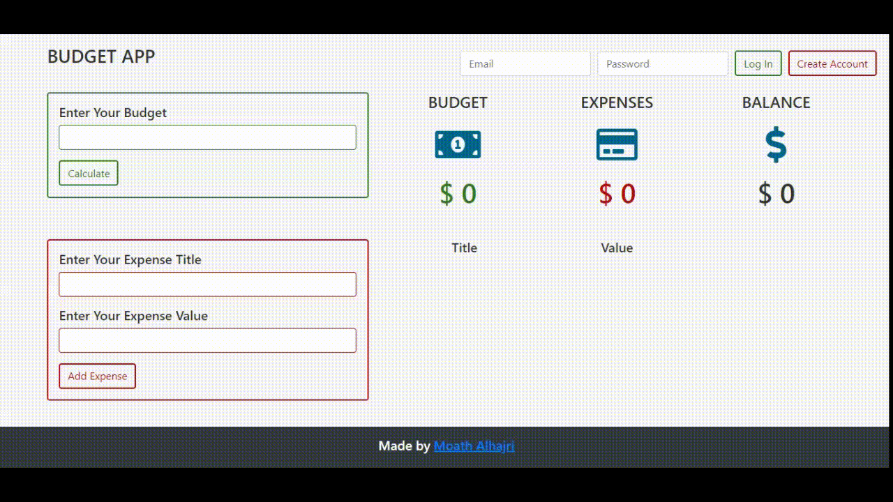
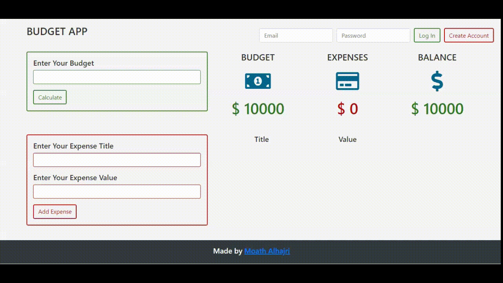
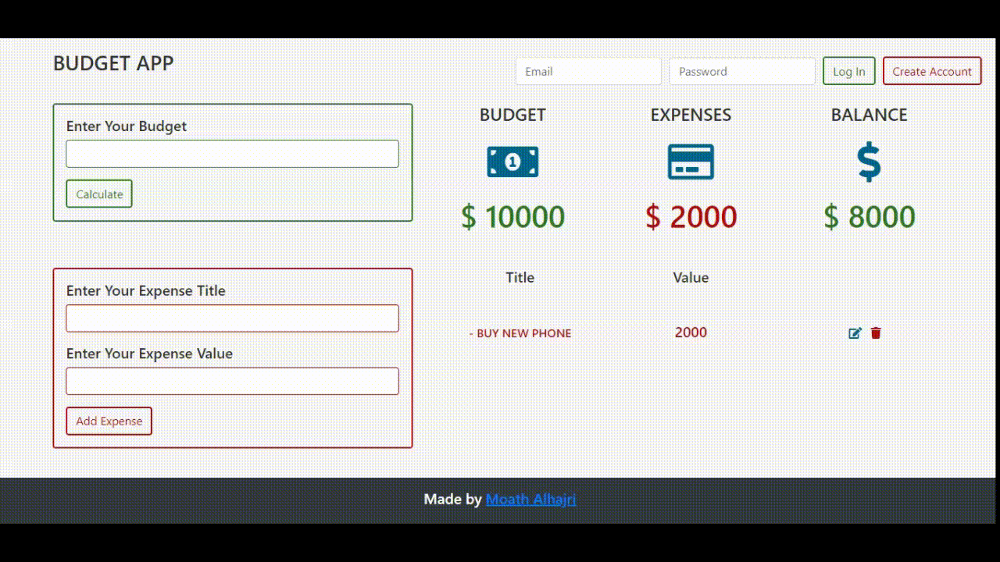
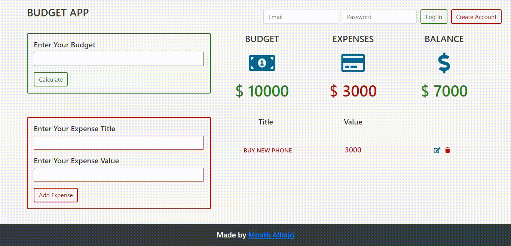
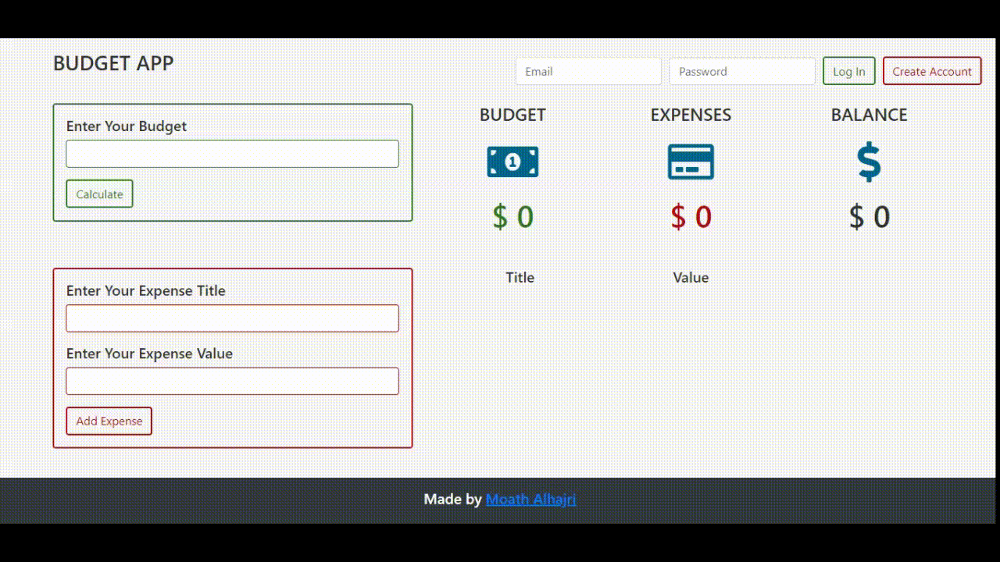

# Budget App
Manage your finance tasks

## Table of Content
* [Technologies Used](#technologies-used)
* [App Functions](#app-functions)

## Technologies Used
* HTML5
* CSS3
* [Bootstrap 4.3.1](https://getbootstrap.com/)
* Vanilla JavaScript
* [Firebase Cloud](https://firebase.google.com/)

## App Functions
* Add budget

  

* Add expense title and expense value

  

* Edit expense information

  

* Delete expense

  

* Save your data (Account Required)

  

